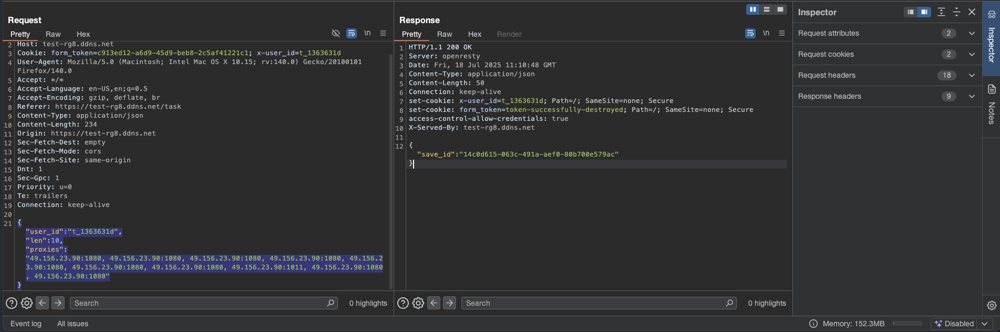

# scrapy_spider_task
## Test task: 

1. Scrape the first 150 proxies and save a file proxis.json
 
output.json structure:
 
[
{"ip": "0.0.0.0", "port": 8080, "protocols": ["HTTP", "HTTPS"]},
{"ip": "1.1.1.1", "port": 3180, "protocols": ["SOCKS4", "SOCKS5"]}
...
]
2. Submit the scraped proxies to the form, using the
provided personal token in the "Personal token" field.
 
results.json structure:
 
{
"save_id_1":["proxy","proxy","..."],
"save_id_2":["proxy","proxy","..."],
"save_id_n":["proxy","proxy","..."]
}

## Solution:
1. 

2. 
 
